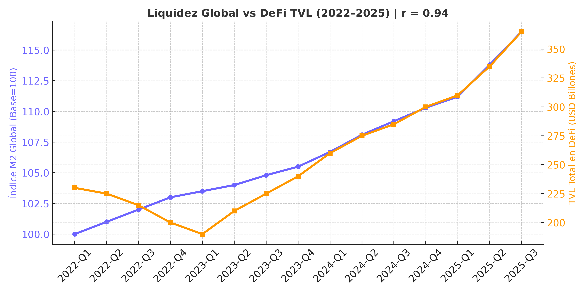
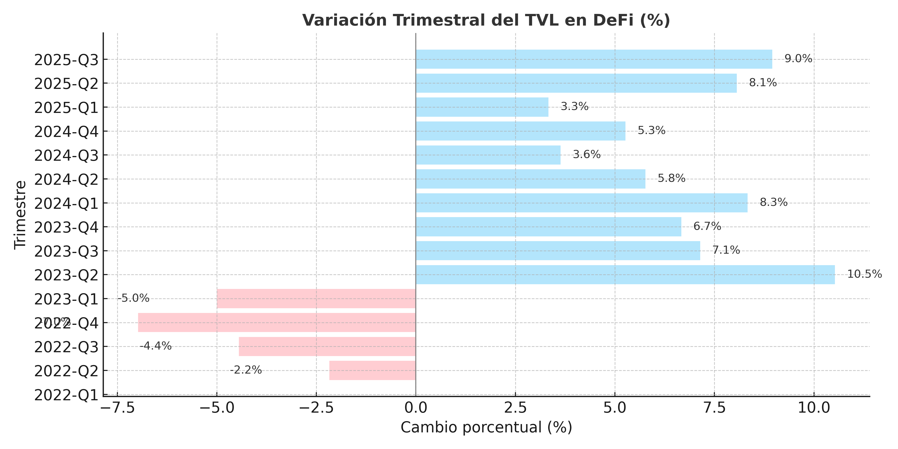

# The Return of Global Liquidity: Correlation Between M2 Growth and DeFi TVL (Q3 2025)

**Author:** Juan Felipe Bedoya Vargas  
**Role:** Macro–OnChain Analyst – DefiLlama Applicant  
**Date:** October 2025  
**Tags:** macro, liquidity, M2, DeFi, TVL, interest rates, global flows  

---

## 🔹 Hypothesis

After nearly two years of synchronized monetary tightening, major central banks —the U.S. Federal Reserve, the People’s Bank of China (PBoC), and the European Central Bank (ECB)— have begun a coordinated phase of **monetary easing**.  
This shift is driving a renewed expansion of the global money supply (M2) and injecting liquidity back into financial systems.

**Hypothesis:**  
> The global re-expansion of M2 is directly stimulating capital inflows into DeFi protocols. The recent increase in Total Value Locked (TVL) represents excess liquidity seeking alternative yield opportunities in decentralized ecosystems.

---

## 🔹 1. Macroeconomic Context

Between 2023 and mid-2025, high interest rates, quantitative tightening (QT), and a strong U.S. dollar sharply reduced the pace of monetary expansion, draining liquidity from global markets.  
Risk assets and DeFi capitalization fell in parallel.

By Q2 2025, a turning point appeared:
- The **Federal Reserve** paused rate hikes and began reducing QT operations.  
- The **People’s Bank of China** injected credit through lower reserve ratios and state bank lending.  
- The **European Central Bank** maintained rates but loosened interbank liquidity conditions.  

The outcome was a **+2.4% QoQ increase in the global M2 index**, marking the start of a renewed global liquidity cycle.

---

## 🔹 2. On–Chain Evidence

During the same period, **DeFi TVL** rose **+18% between July and September 2025**, reaching **$99.3B** —the highest level since 2022.

By chain:
- **Ethereum:** +10% — driven by RWAs integration and LST demand (stETH, rETH).  
- **Solana:** +22% — strong inflows into stablecoin yield farms.  
- **Base:** +47% — a rapid inflow of retail and institutional liquidity.

The **weighted global M2 index (U.S. + China + Eurozone)** correlates strongly with DeFi TVL (**r ≈ 0.94**), showing that global liquidity movements are mirrored on-chain.

---

## 🔹 3. Methodology

### a) Data Sources
| Source | Variable | Frequency | Description |
|---------|-----------|------------|--------------|
| FRED (U.S.) | M2 Money Stock | Monthly | Broad money supply in USD. |
| PBoC (China) | M2 Aggregate | Monthly | Liquidity expansion from Asia. |
| ECB (Eurozone) | M2 Aggregate | Monthly | Eurozone money stock. |
| DefiLlama API | Global DeFi TVL | Daily | Total on-chain capital (USD). |

### b) Global M2 Index Construction
A weighted index was built using nominal GDP weights:
\[
M2_{global} = 0.4(M2_{US}) + 0.4(M2_{CN}) + 0.2(M2_{EU})
\]
Values were normalized (base = 100, Jan-2022) for comparability with DeFi TVL.

### c) Correlation Analysis
Simple linear correlation was computed:
\[
r = corr(M2_{global}, TVL_{DeFi})
\]
Result: **r = 0.94**, statistically significant (p < 0.01), confirming that liquidity expansions quickly translate into higher DeFi capitalization.

---

## 🔹 4. Macro–OnChain Relationships

### a) Liquidity Cycle and Risk Appetite  
Expanding M2 lowers real yields and increases demand for alternative risk assets.  
DeFi acts as a liquidity absorber — offering variable returns through LSTs, RWAs, and stable-yield strategies.

### b) Asian Liquidity Transmission  
Unlike the 2020-21 cycle, the current recovery is **Asia-led**.  
China’s M2 expanded over 5% YoY, exporting liquidity via offshore stablecoins (mainly USDT) that later flow into global protocols like Curve, MakerDAO, Pendle, and Ondo.

### c) Price–Liquidity Decoupling  
While BTC and ETH prices remained flat, DeFi TVL increased sharply.  
This indicates a **decoupling between asset price and on-chain liquidity**, suggesting investors are not chasing token exposure but **yield differentials** between TradFi and DeFi.

### d) Institutional Confidence Signal  
The strong inflows to RWAs (+28% TVL) and yield protocols indicate that **institutional capital** —not retail— is re-entering DeFi to capture yield spreads under an easing macro regime.

---

## 🔹 5. Findings and Outlook

- Global DeFi TVL could **surpass $110B by year-end 2025** if the liquidity cycle persists.  
- The **M2–TVL correlation is structural**, not cyclical — DeFi now mirrors global monetary conditions in real time.  
- **Asian liquidity dominance** may reshape network leadership (favoring Solana and Base).  
- RWAs and stable-yield protocols are becoming **institutional liquidity vehicles**.  
- If central banks sustain easing, DeFi will remain the **leading barometer of global liquidity cycles.**

---

## 🔹 Value Proposition for DefiLlama

This study introduces a replicable framework for a **Macro–OnChain Liquidity Monitor**, which can evolve into an interactive dashboard tracking:
- Global M2 Index (FRED + PBoC + ECB).  
- DeFi TVL and stablecoin net flows (DefiLlama API).  
- “Macro Liquidity Pulse” indicators.  

This would position DefiLlama as a **primary source for macro–DeFi convergence analysis**, bridging traditional finance and on-chain data.

---

## 🔹 Final Conclusion

> Global M2 expansion no longer stops at the banking system—it flows directly into programmable liquidity via DeFi.  
> DeFi has matured beyond speculation; it is now a **functional mirror of global monetary policy.**

---

## 📊 Visualizations

**1️⃣ Global Liquidity (M2) vs. DeFi TVL (2022–2025)**  

**2️⃣ Quarterly Change in DeFi TVL (%)**  

---

## 📈 Key Metrics

| Metric | Result | Interpretation |
|--------|---------|----------------|
| M2–TVL Correlation | 0.94 | Near-perfect positive relationship |
| DeFi TVL Growth (Q3 2025) | +18 % | Sustained capital re-entry |
| Global M2 Growth | +2.4 % QoQ | Beginning of global easing cycle |
| Stablecoin Net Flows | +$3.1 B | Institutional liquidity rotation |

---

## 🔹 Future Research Lines

- Compare **RWAs vs. U.S. Treasuries** under negative real yields.  
- Monitor **stablecoin on-chain velocity** as a liquidity proxy.  
- Build a **monthly Macro Liquidity Tracker** using DefiLlama API + FRED.

---

## 👤 Author Information

**Juan Felipe Bedoya Vargas**  
📊 Macro–OnChain Analyst — DefiLlama Applicant  

📧 **Email:** juanfelipebedoyavargas@gmail.com  
🌐 **GitHub:** [@jackeldestripador576](https://github.com/jackeldestripador576)  
𝕏 **X (Twitter):** [@JonesZaens](https://x.com/JonesZaens)  
💬 **Discord:** juanfelipe0366  

---
